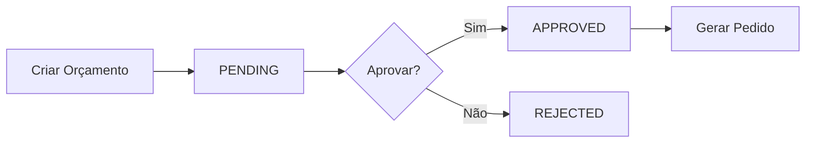
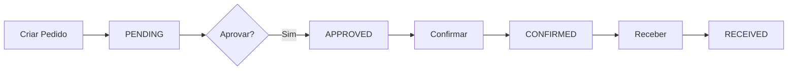

# 🔐 Permissões de Aprovação - Módulo de Compras

## ✅ Implementação Concluída

Foi implementado um sistema de aprovação para Orçamentos e Pedidos de Compra com permissões específicas.

---

## 🎯 Novas Permissões

### **1. Aprovar Orçamentos**
- **Recurso**: `purchases`
- **Ação**: `approve_quotation`
- **Descrição**: Aprovar orçamentos de compra
- **Quem tem**: ADMIN, MANAGER

### **2. Aprovar Pedidos**
- **Recurso**: `purchases`
- **Ação**: `approve_order`
- **Descrição**: Aprovar pedidos de compra
- **Quem tem**: ADMIN, MANAGER

---

## 📋 Fluxo de Aprovação

### **Orçamentos**



**Status:**
- `PENDING` - Aguardando aprovação
- `SENT` - Enviado ao fornecedor
- `RECEIVED` - Resposta recebida
- `APPROVED` - ✅ Aprovado (pode gerar pedido)
- `REJECTED` - ❌ Rejeitado
- `EXPIRED` - Expirado

**Regra:** Apenas orçamentos com status **APPROVED** podem gerar pedidos!

### **Pedidos**



**Status:**
- `PENDING` - Aguardando aprovação
- `APPROVED` - ✅ Aprovado (pode confirmar)
- `CONFIRMED` - Confirmado (aguardando entrega)
- `PARTIAL` - Parcialmente recebido
- `RECEIVED` - Totalmente recebido
- `CANCELLED` - Cancelado

**Regra:** Apenas pedidos com status **APPROVED** podem ser confirmados!

---

## 📡 Novos Endpoints

### **Orçamentos**

#### Aprovar Orçamento
```http
PATCH /api/v1/purchase-quotations/:id/approve
Authorization: Bearer {token}
Permissão: purchases:approve_quotation
```

**Resposta:**
```json
{
  "status": "success",
  "message": "Orçamento aprovado com sucesso",
  "data": {
    "id": "uuid",
    "quotationNumber": "ORC-2025-0001",
    "status": "APPROVED",
    ...
  }
}
```

#### Rejeitar Orçamento
```http
PATCH /api/v1/purchase-quotations/:id/reject
Authorization: Bearer {token}
Permissão: purchases:approve_quotation
```

### **Pedidos**

#### Aprovar Pedido
```http
PATCH /api/v1/purchase-orders/:id/approve
Authorization: Bearer {token}
Permissão: purchases:approve_order
```

**Resposta:**
```json
{
  "status": "success",
  "message": "Pedido aprovado com sucesso",
  "data": {
    "id": "uuid",
    "orderNumber": "PC-2025-0001",
    "status": "APPROVED",
    ...
  }
}
```

---

## 🔒 Validações Implementadas

### **Backend**

#### Orçamento → Pedido
```typescript
// Em purchase-order.service.ts
if (quotation.status !== 'APPROVED') {
  throw new Error('Apenas orçamentos APROVADOS podem gerar pedidos. Status atual: ' + quotation.status);
}
```

#### Pedido → Confirmação
```typescript
// Em purchase-order.service.ts
if (order.status !== 'APPROVED') {
  throw new Error('Apenas pedidos APROVADOS podem ser confirmados. Status atual: ' + order.status);
}
```

---

## 🎨 Interface do Usuário

### **Tela de Orçamentos**

**Botões que aparecem:**
- **Ver** - Sempre visível
- **Aprovar** - Apenas se status = PENDING e usuário tem permissão
- **Rejeitar** - Apenas se status = PENDING e usuário tem permissão
- **Gerar Pedido** - Apenas se status = APPROVED
- **Excluir** - Sempre visível (com permissão)

### **Tela de Pedidos**

**Botões que aparecem:**
- **Ver** - Sempre visível
- **Aprovar** - Apenas se status = PENDING e usuário tem permissão
- **Confirmar** - Apenas se status = APPROVED
- **Cancelar** - Se status != RECEIVED e != CANCELLED
- **Excluir** - Sempre visível (com permissão)

---

## 🚀 Como Usar

### **1. Executar Seed (Adicionar Permissões)**

```bash
cd backend
npm run prisma:seed
```

Isso criará as novas permissões:
- ✅ `purchases:approve_quotation`
- ✅ `purchases:approve_order`

### **2. Fluxo Completo de Orçamento**

```bash
# 1. Criar orçamento (qualquer usuário com purchases:create)
POST /api/v1/purchase-quotations
Status: PENDING

# 2. Aprovar orçamento (apenas ADMIN/MANAGER)
PATCH /api/v1/purchase-quotations/:id/approve
Status: APPROVED

# 3. Gerar pedido (qualquer usuário com purchases:create)
POST /api/v1/purchase-orders/from-quotation
Status: PENDING
```

### **3. Fluxo Completo de Pedido**

```bash
# 1. Criar pedido (qualquer usuário com purchases:create)
POST /api/v1/purchase-orders
Status: PENDING

# 2. Aprovar pedido (apenas ADMIN/MANAGER)
PATCH /api/v1/purchase-orders/:id/approve
Status: APPROVED

# 3. Confirmar pedido (qualquer usuário com purchases:update)
PATCH /api/v1/purchase-orders/:id/confirm
Status: CONFIRMED

# 4. Receber materiais (futuro)
Status: RECEIVED
```

---

## 👥 Perfis e Permissões

| Perfil | Criar | Visualizar | Editar | Excluir | Aprovar Orçamento | Aprovar Pedido |
|--------|-------|------------|--------|---------|-------------------|----------------|
| **ADMIN** | ✅ | ✅ | ✅ | ✅ | ✅ | ✅ |
| **MANAGER** | ✅ | ✅ | ✅ | ✅ | ✅ | ✅ |
| **OPERATOR** | ✅ | ✅ | ❌ | ❌ | ❌ | ❌ |

---

## 📊 Arquivos Alterados

### Backend (6 arquivos)
1. ✅ `prisma/seed.ts` - Novas permissões
2. ✅ `controllers/purchase-quotation.controller.ts` - Métodos approve/reject
3. ✅ `controllers/purchase-order.controller.ts` - Método approve
4. ✅ `routes/purchase-quotation.routes.ts` - Novas rotas
5. ✅ `routes/purchase-order.routes.ts` - Nova rota
6. ✅ `services/purchase-order.service.ts` - Validações

### Frontend (4 arquivos)
1. ✅ `services/purchase-quotation.service.ts` - Métodos approve/reject
2. ✅ `services/purchase-order.service.ts` - Método approve
3. ✅ `stores/purchase-quotation.store.ts` - Actions approve/reject
4. ✅ `stores/purchase-order.store.ts` - Action approveOrder

---

## ✅ Benefícios

1. ✅ **Controle de Alçada** - Apenas gestores aprovam
2. ✅ **Rastreabilidade** - Histórico de aprovações
3. ✅ **Segurança** - Validações no backend
4. ✅ **Flexibilidade** - Permissões granulares
5. ✅ **Auditoria** - Logs de todas as ações

---

## 🎉 Conclusão

O sistema de aprovação está **100% implementado** e pronto para uso!

**Próximos passos:**
1. Executar seed para adicionar permissões
2. Testar fluxo de aprovação
3. Ajustar interface conforme necessário

---

*Documentação criada em: 20/10/2025*  
*Versão: 1.0.0*  
*Status: ✅ COMPLETO*
